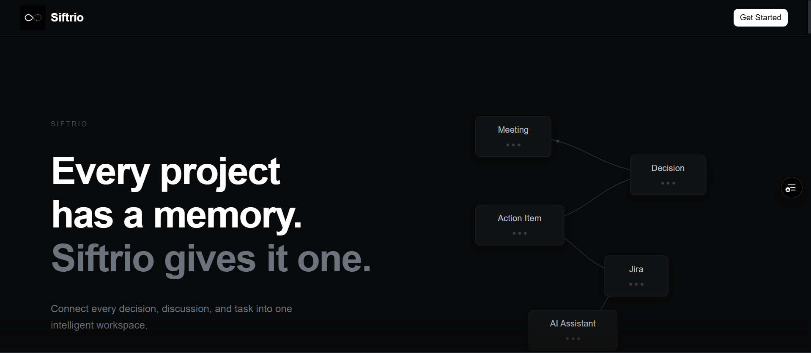
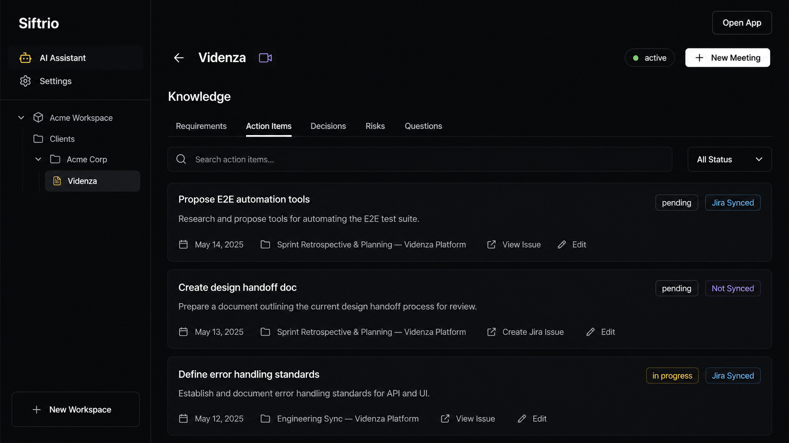
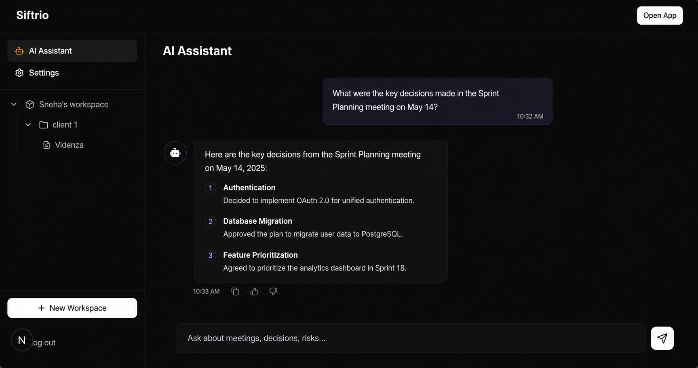

# Siftrio

**AI Project Memory + SDLC Copilot**

---

Projects accumulate months of context — meeting decisions, shifting requirements, action items, risks, and stakeholder discussions — scattered across calendars, transcripts, project trackers, and chat. Siftrio brings all of this into one centralized knowledge layer and lets your team reason over it using AI.

Ask _why_ a decision was made, _who_ requested a feature, or _what_ is still pending — and get answers with citations sourced from your actual meetings and documents.

---

<p align="center">
  
</p>
<p align="center">
  
</p>

<p align="center">
  
</p>

---

## How It Works

```
Workspace
  └── Clients
        └── Projects
              └── Knowledge Sources
                    ├── Meetings & Transcripts
                    ├── Documents
                    ├── Jira
                    └── More coming soon...
```

All sources are chunked, embedded, and stored in a vector database. AI agents retrieve relevant context and generate grounded responses — not hallucinations.

---

## Features

- **Multi-tenant Workspaces & Projects** — Hierarchical structure: Workspace > Client > Project, with role-based access and team invitations
- **Meeting Ingestion** — Upload transcripts manually or auto-fetch via Fireflies.ai; Google Calendar integration for automatic meeting linking
- **AI Meeting Analysis** — Extracts structured insights: summary, outcomes, blockers, requirements, action items, decisions, risks, and follow-up suggestions
- **Knowledge Entity Management** — Normalized tracking for requirements, action items, decisions, risks, and questions — each linked to its source
- **Approval Queue** — Nothing goes live automatically. Review, edit, approve, or reject extracted items before they take effect
- **Project Memory (RAG Chat)** — Ask questions in natural language and get AI-generated answers with citations from your meetings and documents
- **Jira Integration** — Connect Jira via OAuth, map projects, and sync action items as Jira issues
- **Google Calendar Integration** — Create calendar events and Google Meet links directly from the platform
- **MCP Server** — Query your project's knowledge base from Cursor, VS Code, or any MCP-compatible IDE without leaving your editor
- **Dark-themed Dashboard** — Clean, responsive UI built for daily use

---

## Tech Stack

| Layer            | Technology                                                      |
| ---------------- | --------------------------------------------------------------- |
| Frontend         | Next.js, React, TypeScript, Tailwind CSS, shadcn/ui             |
| Backend          | FastAPI, Python 3.12+                                           |
| Database         | PostgreSQL 17 + pgvector                                        |
| ORM & Migrations | SQLAlchemy 2.0 (Async), Alembic                                 |
| AI / LLM         | LangChain, LangGraph, Mistral AI                                |
| Embeddings       | Mistral AI Embeddings (pgvector HNSW index)                     |
| Auth             | JWT + Google OAuth, Atlassian OAuth                             |
| Integrations     | Fireflies.ai, Jira, Google Calendar                             |
| IDE Integration  | MCP Server (Model Context Protocol)                             |
| Deployment       | Vercel (frontend), FastAPI Cloud (backend), Supabase (database) |

---

## Getting Started

### Prerequisites

- Python 3.12+
- Node.js 18+
- Docker (for local PostgreSQL)

### Setup

```bash
# Clone the repository
git clone https://github.com/your-org/siftrio.git
cd siftrio

# Start PostgreSQL (with pgvector)
docker compose up -d

# Backend setup
cd server
cp .env.example .env   # Configure your environment variables
pip install -r requirements.txt
alembic upgrade head
uvicorn src.main:app --reload

# Frontend setup
cd ../client
pnpm install
pnpm dev
```

The frontend runs at `http://localhost:3000` and the API at `http://localhost:8000`.

---

## Project Status

Siftrio is under active development. New integrations, features, and capabilities are being added regularly. The platform is production-deployed and evolving based on real-world usage.

---

## License

Proprietary. All rights reserved.
